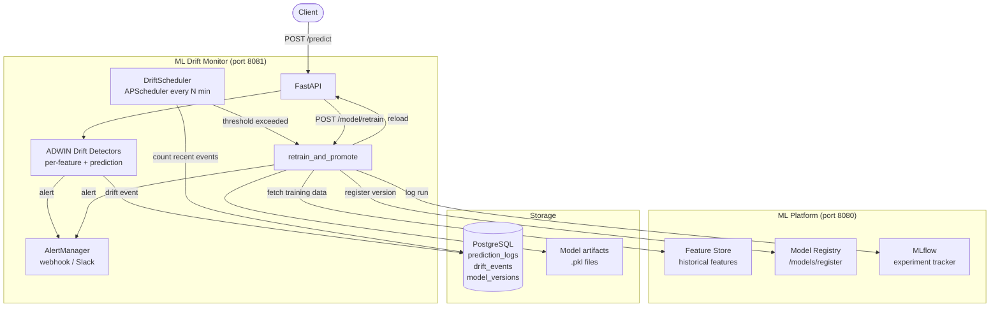

# ML Drift Monitor

[](https://github.com/matthew-fitzgerald123/ml-drift-monitor/actions/workflows/ci.yml)


A production-style ML serving and monitoring system. Serves predictions from a versioned model, detects feature and prediction drift using ADWIN, fires webhook alerts, schedules periodic drift checks, and triggers automated retraining from real features pulled from the P2 feature store. Retrained model versions are registered in the P2 model registry with their MLflow run IDs.

## Architecture



## The Full Loop

1. **Inference** -- client calls `/predict`; features and probability are fed into ADWIN detectors in a background task
2. **Drift detection** -- ADWIN signals drift; a `DriftEvent` is written to Postgres and a webhook alert is fired
3. **Scheduled check** -- every `DRIFT_CHECK_INTERVAL` minutes the scheduler counts recent drift events; if the count reaches `DRIFT_RETRAIN_THRESHOLD` it triggers automatic retraining
4. **Retraining** -- `retrain_and_promote` fetches real historical features from the P2 feature store (falls back to synthetic if unavailable), trains a new LogisticRegression, logs to MLflow, and saves the artifact
5. **Promotion** -- the new version is registered in the P2 model registry with its MLflow run ID; the active model in P3 is swapped and all ADWIN detectors are reset

## Stack

| Component | Library / Service |
|---|---|
| API | FastAPI + uvicorn (port 8081) |
| Drift detection | River 0.21.2 (ADWIN) |
| Model training | scikit-learn (LogisticRegression) |
| Scheduling | APScheduler (AsyncIOScheduler) |
| Alerting | Webhook / Slack (configurable via env) |
| Experiment tracking | MLflow (shared with P2) |
| Feature source | P2 feature store REST API |
| Model registry | P2 model registry REST API |
| Data store | PostgreSQL + SQLAlchemy |

## Setup

Requires PostgreSQL running locally. Retraining calls out to the [ml-platform](https://github.com/matthew-fitzgerald123/ml-platform) (P2) API at `P2_API_URL`, so start that service first if you want live retraining rather than the synthetic fallback.

```bash
createdb ml_drift_monitor
pip install -r requirements.txt
make seed
```

## Running

```bash
make serve      # API at http://localhost:8081
make demo       # simulate drift and retraining
make test       # run test suite
```

## Environment Variables

| Variable | Default | Description |
|---|---|---|
| `DATABASE_URL` | `postgresql://localhost/drift_monitor` | Postgres connection |
| `P2_API_URL` | `http://localhost:8080` | P2 ML platform base URL |
| `P2_FEATURE_SET` | `financial_signals` | Feature set to pull for retraining |
| `P2_MODEL_NAME` | `drift-monitor-model` | Model name to register new versions under in the P2 registry |
| `DRIFT_CHECK_INTERVAL` | `15` | Scheduler interval in minutes |
| `DRIFT_RETRAIN_THRESHOLD` | `5` | Drift events per window before auto-retrain |
| `ALERT_WEBHOOK_URL` | _(unset)_ | POST target for drift/retrain alerts |
| `MLFLOW_TRACKING_URI` | `postgresql://localhost/mlplatform` | MLflow backend |

## API Reference

### Inference
| Method | Path | Description |
|---|---|---|
| POST | `/predict` | Predict, log, trigger background drift check |

### Monitoring
| Method | Path | Description |
|---|---|---|
| GET | `/drift/events` | Recent drift events |
| GET | `/drift/summary` | Total drift count + active model |
| GET | `/drift/features` | Live per-feature ADWIN state: which features are drifting + window stats |
| GET | `/predictions/recent` | Recent prediction log |
| GET | `/scheduler/status` | Scheduler state, interval, next run |

### Model Management
| Method | Path | Description |
|---|---|---|
| POST | `/model/retrain` | Trigger manual retrain in background |
| GET | `/model/versions` | All versioned models with metrics |
| GET | `/health` | Server status + model loaded |

## Project Structure

```
app/
  main.py                 FastAPI app, lifespan, all routes
  drift_detector.py       FeatureDriftDetector + PredictionDriftDetector (ADWIN)
  scheduler.py            DriftScheduler (APScheduler, auto-retrain)
  alerting.py             Webhook/Slack alert sender
  feature_store_client.py HTTP client for P2 historical features
  retraining.py           retrain_and_promote, P2 registry integration
  model_store.py          versioned model load/save/retrain
  models.py               SQLAlchemy ORM models
  database.py             engine + session factory
scripts/
  seed_model.py           train and register v1 model
notebooks/
  demo.py                 simulate predictions and drift
models/
  *.pkl                   saved model artifacts
tests/
  test_drift_monitor.py   integration + unit tests
```
